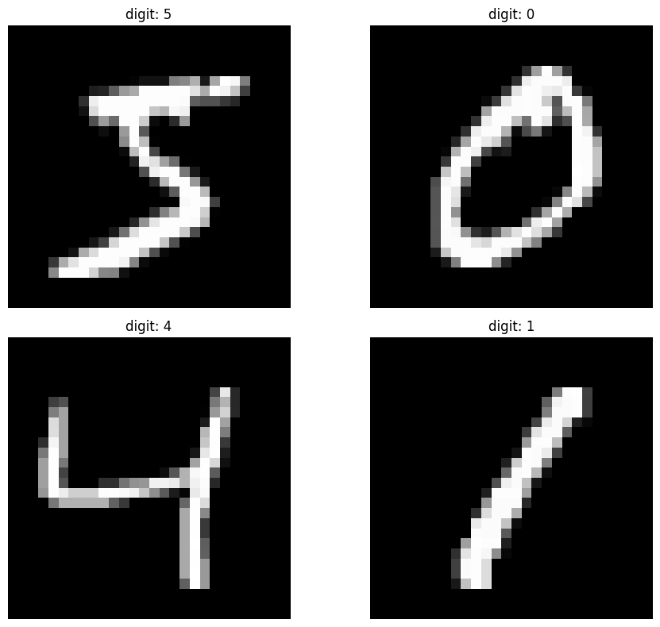
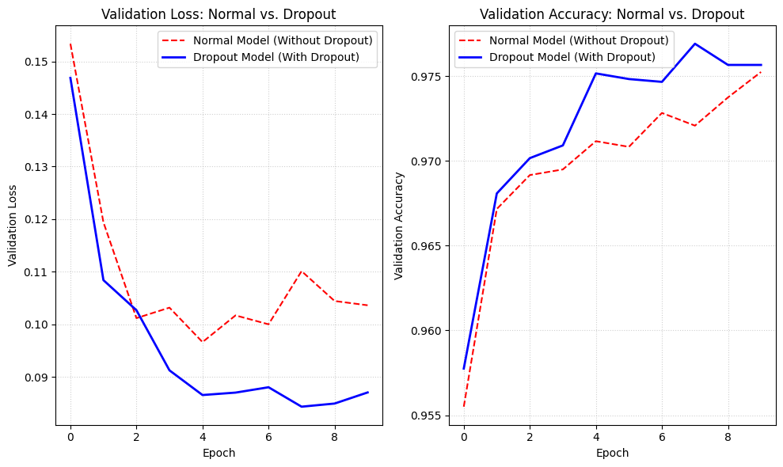
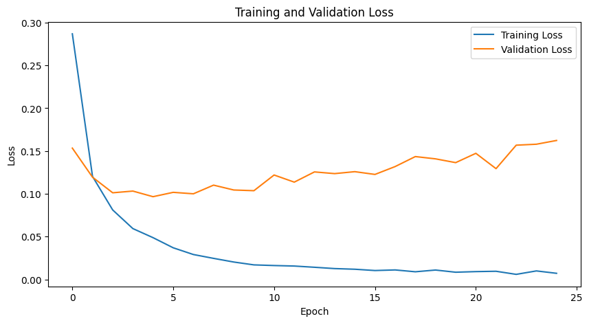
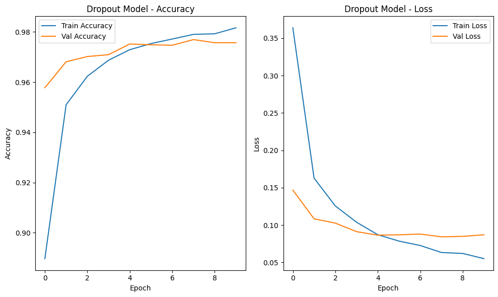
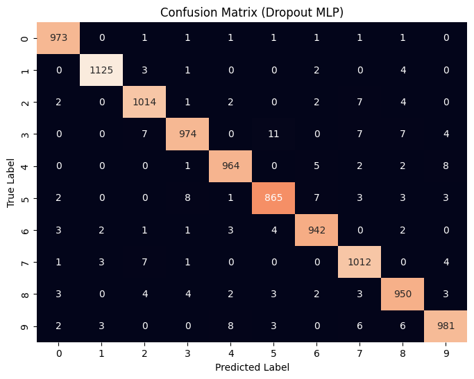
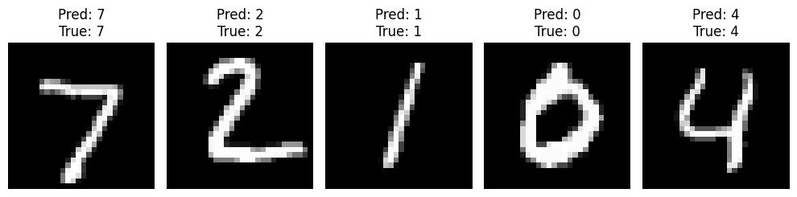

# ✍️ Handwritten Digit Classification (MNIST)

An end-to-end Deep Learning project using **TensorFlow** and **Keras** to classify handwritten digits (0–9) from the classic **MNIST** dataset with **98.00% test accuracy**.

---

## 📌 Project Overview

This project builds, trains, diagnoses, and optimizes a Multi-Layer Perceptron (MLP) neural network to recognize handwritten digits. 

Key milestones achieved:
- **Data Preprocessing:** Rescaled 70,000 grayscale images ($28 \times 28$ pixels) to $[0.0, 1.0]$.
- **Overfitting Diagnosis:** Identified severe overfitting in the baseline model via training/validation loss curve analysis.
- **Regularization:** Applied **Dropout (0.2)** to eliminate overfitting, cutting test loss by more than **52%** (`0.1477` $\rightarrow$ `0.0707`).
- **Comprehensive Evaluation:** Evaluated on 10,000 unseen test images, generating a full Confusion Matrix and per-digit Classification Report.
- **Interactive Inference:** Added user-input capabilities (custom image upload with automatic color inversion and interactive index inspection).

---

## 📊 Dataset: MNIST

The **MNIST** (Modified National Institute of Standards and Technology) dataset is the benchmark dataset in computer vision:
- **Training Samples:** 60,000 images
- **Testing Samples:** 10,000 images
- **Image Size:** $28 \times 28$ pixels (grayscale)
- **Classes:** 10 digits (`0` to `9`)



---

## 🏗️ Model Architecture

To keep the model lightweight and fast while maintaining high accuracy, a streamlined Multi-Layer Perceptron (MLP) architecture was designed:

```text
Input (28 x 28)
       │
    Flatten (784)
       │
 Dense (128, ReLU)
       │
  Dropout (0.2)
       │
 Dense (128, ReLU)
       │
  Dropout (0.2)
       │
 Dense (10, Softmax)
```

- **Optimizer:** `adam`
- **Loss Function:** `sparse_categorical_crossentropy`
- **Metrics:** `accuracy`

---

## 🔬 Experiments & Key Findings

### Baseline Model vs. Dropout Model

| Metric | Baseline Model (No Dropout) | Dropout Model (`Dropout(0.2)`) | Impact |
| :--- | :--- | :--- | :--- |
| **Epochs Trained** | 25 | 10 | Faster convergence |
| **Validation Loss** | `0.1593` (doubled from epoch 3) | **`0.0871`** (stable at `0.084`) | Overfitting prevented |
| **Test Accuracy** | `97.48%` | **`98.00%`** | **+0.52% boost** (9,800/10,000 correct) |
| **Test Loss** | `0.1477` | **`0.0707`** | **52% lower loss** |



### Why Dropout Made the Difference
Without Dropout, the model rapidly memorized individual pixel positions from the training set, causing the validation loss to almost double:



Adding `Dropout(0.2)` prevented neuron co-adaptation, forcing the network to learn robust, general features (loops, strokes, curves) and stabilizing learning:



---

## 📈 Evaluation & Results

### Confusion Matrix (10,000 Test Images)



### Classification Report

```text
              precision    recall  f1-score   support

           0       0.99      0.99      0.99       980
           1       0.99      0.99      0.99      1135
           2       0.98      0.98      0.98      1032
           3       0.98      0.96      0.97      1010
           4       0.98      0.98      0.98       982
           5       0.98      0.97      0.97       892
           6       0.98      0.98      0.98       958
           7       0.97      0.98      0.98      1028
           8       0.97      0.98      0.97       974
           9       0.98      0.97      0.98      1009

    accuracy                           0.98     10000
   macro avg       0.98      0.98      0.98     10000
weighted avg       0.98      0.98      0.98     10000
```

- **Easiest Digits:** `0` and `1` achieved **99% F1-score**.
- **Challenging Digits:** `3`, `5`, and `8` achieved **97% F1-score** due to visual overlap in handwritten styles.

### Sample Model Predictions



---

## 🚀 How to Run the Project

### 1. Prerequisites
Install required dependencies:
```bash
pip install -r requirements.txt
```

### 2. Run the Notebook
Open and run [`handwritten_digit_classification.ipynb`](handwritten_digit_classification.ipynb) in Jupyter Notebook or Google Colab:
```bash
jupyter notebook handwritten_digit_classification.ipynb
```

---

## 🎨 Interactive User Input

The notebook includes two interactive ways to test the model:

1. **Upload Custom Digit Images:**
   - Draw any digit on paper or in MS Paint, save as PNG/JPG, and upload it.
   - The script automatically converts the image to grayscale, resizes it to $28 \times 28$, **inverts colors if drawn on white paper** to match MNIST format, and displays the predicted digit with confidence probabilities.

2. **Index-Based Inspection:**
   - Input any index between `0` and `9999` to inspect the test set image, true label, and model confidence bar chart.

---

## 📁 Repository Structure

```text
Handwritten_Digit_Classification/
├── assets/                                  # Plots & visual analysis images
│   ├── sample_digits.png
│   ├── baseline_accuracy.png
│   ├── baseline_loss_overfitting.png
│   ├── dropout_learning_curves.png
│   ├── normal_vs_dropout_comparison.png
│   ├── confusion_matrix.png
│   └── sample_predictions.png
├── handwritten_digit_classification.ipynb   # Main Jupyter notebook with all code & visualizations
├── README.md                                # Project documentation
├── pyproject.toml                           # Project configuration
└── requirements.txt                         # Dependencies list
```

---

## 👤 Author
- **Anuj Kumar** - [@Anuj04432](https://github.com/Anuj04432)
